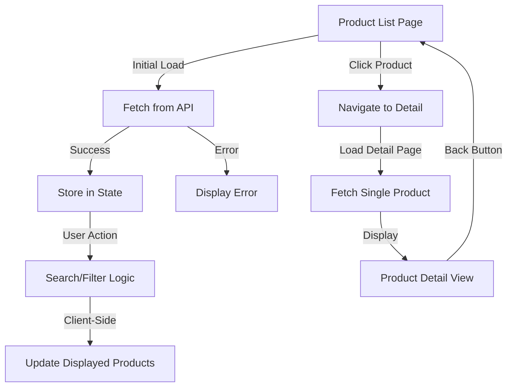

# Design Document: Product Dashboard

## Overview

The Product Dashboard feature provides a comprehensive interface for viewing, searching, and filtering products within a Next.js application. The implementation follows a client-side data management approach where products are fetched once from the API and all filtering/searching operations are performed on the client side for optimal performance.

The feature consists of two main views:
1. **Product List View**: A searchable, filterable grid/list of products
2. **Product Detail View**: A detailed view of a single product

The implementation leverages Next.js 16 App Router conventions, React hooks for state management, and integrates seamlessly with the existing authentication system and theme configuration.

## Architecture

### Component Hierarchy

```
/dashboard/products (Product List Page)
├── ProductListContainer (Main container component)
│   ├── SearchBar (Search input component)
│   ├── FilterControls (Category and subcategory filters)
│   ├── ProductGrid (Grid/list layout component)
│   │   └── ProductCard (Individual product display)
│   └── EmptyState (No results/no products message)
│
/dashboard/products/[id] (Product Detail Page)
├── ProductDetailContainer (Main container component)
│   ├── ProductDetailView (Full product information display)
│   └── BackButton (Navigation back to list)
```

### Data Flow



### Routing Structure

- `/dashboard/products` - Product list page (new route)
- `/dashboard/products/[id]` - Product detail page (dynamic route)

## Components and Interfaces

### TypeScript Interfaces

```typescript
// Product data structure matching API response
interface Product {
  id: number;
  name: string;
  description: string | null;
  price: string;
  originalPrice: string | null;
  imageUrl: string | null;
  category: string;
  subCategory: string;
  createdAt: string;
  updatedAt: string;
}

// API response structure
interface ProductsApiResponse {
  count: number;
  rows: Product[];
}

// Filter state
interface FilterState {
  searchTerm: string;
  category: string | null;
  subCategory: string | null;
}
```

### Component Specifications

#### 1. ProductListContainer

**Purpose**: Main container component managing product data, search, and filter state.

**State**:
- `products: Product[]` - All products fetched from API
- `filteredProducts: Product[]` - Products after applying filters/search
- `filterState: FilterState` - Current filter and search values
- `isLoading: boolean` - Loading state for API request
- `error: string | null` - Error message if API fails

**Key Functions**:
```typescript
// Fetch products from API
async function fetchProducts(): Promise<void>

// Apply search and filters to products
function applyFilters(
  products: Product[], 
  filterState: FilterState
): Product[]

// Handle search input change
function handleSearchChange(searchTerm: string): void

// Handle category filter change
function handleCategoryChange(category: string | null): void

// Handle subcategory filter change
function handleSubCategoryChange(subCategory: string | null): void
```

#### 2. SearchBar

**Purpose**: Provides search input for filtering products by name or description.

**Props**:
- `value: string` - Current search term
- `onChange: (value: string) => void` - Callback for search changes
- `placeholder?: string` - Optional placeholder text

**Implementation**:
- Debounced input to avoid excessive re-renders
- Clear button when search term is present
- Accessible with proper ARIA labels

#### 3. FilterControls

**Purpose**: Provides dropdown filters for category and subcategory.

**Props**:
- `categories: string[]` - Available categories
- `subCategories: string[]` - Available subcategories
- `selectedCategory: string | null` - Current category filter
- `selectedSubCategory: string | null` - Current subcategory filter
- `onCategoryChange: (category: string | null) => void`
- `onSubCategoryChange: (subCategory: string | null) => void`

**Implementation**:
- Extract unique categories/subcategories from product data
- "All" option to clear filter
- Responsive layout (stacked on mobile, inline on desktop)

#### 4. ProductGrid

**Purpose**: Displays products in a responsive grid layout.

**Props**:
- `products: Product[]` - Products to display
- `onProductClick: (productId: number) => void` - Navigation handler

**Implementation**:
- CSS Grid with responsive columns (1 on mobile, 2-4 on desktop)
- Smooth transitions for layout changes
- Uses theme spacing and breakpoints

#### 5. ProductCard

**Purpose**: Displays individual product information in a card format.

**Props**:
- `product: Product` - Product data to display

**Implementation**:
```typescript
// Display logic
- Image with fallback placeholder
- Product name (truncated if too long)
- Price display with currency formatting
- Original price with strikethrough if exists
- Category and subcategory badges
- Hover effects using theme colors
- Click handler for navigation
```

#### 6. ProductDetailContainer

**Purpose**: Fetches and displays detailed product information.

**State**:
- `product: Product | null` - Product data
- `isLoading: boolean` - Loading state
- `error: string | null` - Error message

**Key Functions**:
```typescript
// Fetch single product by ID
async function fetchProductById(id: number): Promise<void>

// Navigate back to list
function handleBack(): void
```

#### 7. ProductDetailView

**Purpose**: Displays all product fields in a detailed layout.

**Props**:
- `product: Product` - Product data to display

**Implementation**:
- Large product image with fallback
- All product fields displayed with labels
- Formatted timestamps (createdAt, updatedAt)
- Price display with original price if exists
- Category and subcategory information
- Responsive layout

## Data Models

### Product Model

The Product model represents a single product entity with the following fields:

| Field | Type | Description | Nullable |
|-------|------|-------------|----------|
| id | number | Unique product identifier | No |
| name | string | Product name | No |
| description | string | Product description | Yes |
| price | string | Current price (decimal string) | No |
| originalPrice | string | Original price before discount | Yes |
| imageUrl | string | URL to product image | Yes |
| category | string | Product category | No |
| subCategory | string | Product subcategory | No |
| createdAt | string | ISO 8601 timestamp of creation | No |
| updatedAt | string | ISO 8601 timestamp of last update | No |

### Filter Logic

The filtering algorithm applies multiple criteria in sequence:

```typescript
function applyFilters(
  products: Product[], 
  filterState: FilterState
): Product[] {
  let filtered = products;
  
  // Apply search filter
  if (filterState.searchTerm) {
    const searchLower = filterState.searchTerm.toLowerCase();
    filtered = filtered.filter(product => 
      product.name.toLowerCase().includes(searchLower) ||
      (product.description?.toLowerCase().includes(searchLower) ?? false)
    );
  }
  
  // Apply category filter
  if (filterState.category) {
    filtered = filtered.filter(product => 
      product.category === filterState.category
    );
  }
  
  // Apply subcategory filter
  if (filterState.subCategory) {
    filtered = filtered.filter(product => 
      product.subCategory === filterState.subCategory
    );
  }
  
  return filtered;
}
```

### API Integration

**Endpoint**: `http://localhost:3001/api/products`

**Fetch Implementation**:
```typescript
async function fetchProducts(): Promise<ProductsApiResponse> {
  const response = await fetch('http://localhost:3001/api/products');
  
  if (!response.ok) {
    throw new Error(`API request failed: ${response.status}`);
  }
  
  const data: ProductsApiResponse = await response.json();
  return data;
}

async function fetchProductById(id: number): Promise<Product> {
  const response = await fetch(`http://localhost:3001/api/products/${id}`);
  
  if (!response.ok) {
    throw new Error(`API request failed: ${response.status}`);
  }
  
  const product: Product = await response.json();
  return product;
}
```


## Correctness Properties

*A property is a characteristic or behavior that should hold true across all valid executions of a system—essentially, a formal statement about what the system should do. Properties serve as the bridge between human-readable specifications and machine-verifiable correctness guarantees.*

### Property 1: Complete Product Display

*For any* product in the system, when rendered in the product list, the display should include the product's image (or placeholder), name, price, category, and subCategory.

**Validates: Requirements 1.2**

### Property 2: Original Price Strikethrough Display

*For any* product that has a non-null originalPrice value, the rendered product card should display the originalPrice with strikethrough styling.

**Validates: Requirements 1.3**

### Property 3: Product Count Accuracy

*For any* set of filtered products, the displayed product count should equal the number of products in the filtered result set.

**Validates: Requirements 1.4**

### Property 4: Search Filter Correctness

*For any* search term and any set of products, all products in the filtered results should have either their name or description containing the search term (case-insensitive).

**Validates: Requirements 2.2**

### Property 5: Category Filter Correctness

*For any* selected category and any set of products, all products in the filtered results should have their category field matching the selected category exactly.

**Validates: Requirements 3.3**

### Property 6: SubCategory Filter Correctness

*For any* selected subcategory and any set of products, all products in the filtered results should have their subCategory field matching the selected subcategory exactly.

**Validates: Requirements 3.4**

### Property 7: Filter Composition Correctness

*For any* combination of active filters (search term, category, and/or subcategory) and any set of products, all products in the filtered results should satisfy all active filter conditions simultaneously.

**Validates: Requirements 3.5**

### Property 8: Filter Reset Behavior

*For any* set of products, when all filters and search terms are cleared, the displayed products should equal the complete set of fetched products.

**Validates: Requirements 2.4, 3.6**

### Property 9: Product Navigation Correctness

*For any* product in the list, clicking on that product should trigger navigation to a URL path matching the pattern `/dashboard/products/{product.id}`.

**Validates: Requirements 4.1**

### Property 10: Complete Detail Display

*For any* product, when displayed in the detail view, all product fields (id, name, description, price, originalPrice, imageUrl, category, subCategory, createdAt, updatedAt) should be present in the rendered output.

**Validates: Requirements 4.2**

### Property 11: Client-Side Filter Processing

*For any* filter or search operation after the initial product fetch, no additional API calls should be made to the Product_API endpoint.

**Validates: Requirements 7.2**

## Error Handling

### API Error Handling

**Fetch Failures**:
- Network errors: Display "Unable to connect to server. Please check your connection."
- HTTP 4xx errors: Display "Unable to load products. Please try again later."
- HTTP 5xx errors: Display "Server error occurred. Please try again later."
- Timeout errors: Display "Request timed out. Please try again."

**Implementation**:
```typescript
try {
  const response = await fetch(API_URL);
  if (!response.ok) {
    throw new Error(`HTTP ${response.status}`);
  }
  const data = await response.json();
  setProducts(data.rows);
} catch (error) {
  if (error instanceof TypeError) {
    setError("Unable to connect to server. Please check your connection.");
  } else if (error.message.includes('4')) {
    setError("Unable to load products. Please try again later.");
  } else if (error.message.includes('5')) {
    setError("Server error occurred. Please try again later.");
  } else {
    setError("An unexpected error occurred. Please try again.");
  }
}
```

### Image Loading Errors

**Fallback Strategy**:
- Use `onError` handler on `` elements
- Replace failed image with placeholder
- Placeholder should use theme colors and display product initial or icon

```typescript
function handleImageError(event: React.SyntheticEvent<HTMLImageElement>) {
  event.currentTarget.src = '/placeholder-product.png';
  event.currentTarget.onerror = null; // Prevent infinite loop
}
```

### Invalid Product ID

**Detail Page Error Handling**:
- Check if product fetch returns 404
- Display error message: "Product not found"
- Provide link back to product list
- Log error for debugging

### Empty States

**No Products**:
- Display when `products.length === 0` after successful fetch
- Message: "No products available"
- Optional: Add illustration or icon

**No Search/Filter Results**:
- Display when `filteredProducts.length === 0` but `products.length > 0`
- Message: "No products match your search criteria"
- Show current filters/search term
- Provide "Clear filters" button

## Testing Strategy

### Dual Testing Approach

The testing strategy employs both unit tests and property-based tests to ensure comprehensive coverage:

- **Unit tests**: Verify specific examples, edge cases, error conditions, and integration points
- **Property-based tests**: Verify universal properties across randomized inputs

### Property-Based Testing Configuration

**Library**: We will use **fast-check** for TypeScript/JavaScript property-based testing.

**Configuration**:
- Minimum 100 iterations per property test
- Each property test must reference its design document property using a comment tag
- Tag format: `// Feature: product-dashboard, Property {number}: {property_text}`

**Example Property Test Structure**:
```typescript
import fc from 'fast-check';

// Feature: product-dashboard, Property 4: Search Filter Correctness
test('search filter returns only matching products', () => {
  fc.assert(
    fc.property(
      fc.array(productArbitrary),
      fc.string(),
      (products, searchTerm) => {
        const filtered = applySearchFilter(products, searchTerm);
        return filtered.every(p => 
          p.name.toLowerCase().includes(searchTerm.toLowerCase()) ||
          (p.description?.toLowerCase().includes(searchTerm.toLowerCase()) ?? false)
        );
      }
    ),
    { numRuns: 100 }
  );
});
```

### Unit Testing Focus Areas

**Component Rendering**:
- ProductCard renders with correct product data
- SearchBar displays and handles input correctly
- FilterControls displays dropdown options
- EmptyState displays appropriate messages

**Edge Cases**:
- Empty product list
- Products with null description
- Products with null originalPrice
- Products with null imageUrl
- Search with no results
- Filter with no results
- Very long product names
- Special characters in search

**Error Conditions**:
- API fetch failure
- Invalid product ID in detail view
- Image load failure
- Network timeout

**Integration Points**:
- Navigation between list and detail views
- Theme integration
- API response parsing

### Test Data Generators

For property-based testing, we need generators (arbitraries) for:

```typescript
// Product generator
const productArbitrary = fc.record({
  id: fc.integer({ min: 1 }),
  name: fc.string({ minLength: 1, maxLength: 100 }),
  description: fc.option(fc.string({ maxLength: 500 })),
  price: fc.float({ min: 0.01, max: 10000 }).map(n => n.toFixed(2)),
  originalPrice: fc.option(fc.float({ min: 0.01, max: 10000 }).map(n => n.toFixed(2))),
  imageUrl: fc.option(fc.webUrl()),
  category: fc.constantFrom('Mandala', 'Art', 'Decor', 'Jewelry'),
  subCategory: fc.constantFrom('Wall Mandala', 'Floor Mandala', 'Pendant', 'Ring'),
  createdAt: fc.date().map(d => d.toISOString()),
  updatedAt: fc.date().map(d => d.toISOString())
});

// Filter state generator
const filterStateArbitrary = fc.record({
  searchTerm: fc.string({ maxLength: 50 }),
  category: fc.option(fc.constantFrom('Mandala', 'Art', 'Decor', 'Jewelry')),
  subCategory: fc.option(fc.constantFrom('Wall Mandala', 'Floor Mandala', 'Pendant', 'Ring'))
});
```

### Testing Tools

- **Test Runner**: Jest (or Vitest if preferred for Next.js)
- **Property Testing**: fast-check
- **Component Testing**: React Testing Library
- **Mocking**: MSW (Mock Service Worker) for API mocking
- **Coverage**: Aim for >80% code coverage

### Test Organization

```
src/
├── app/
│   └── dashboard/
│       └── products/
│           ├── __tests__/
│           │   ├── ProductListContainer.test.tsx
│           │   ├── ProductListContainer.properties.test.tsx
│           │   ├── SearchBar.test.tsx
│           │   ├── FilterControls.test.tsx
│           │   ├── ProductCard.test.tsx
│           │   └── filters.properties.test.tsx
│           └── [id]/
│               └── __tests__/
│                   ├── ProductDetailContainer.test.tsx
│                   └── ProductDetailView.test.tsx
```
